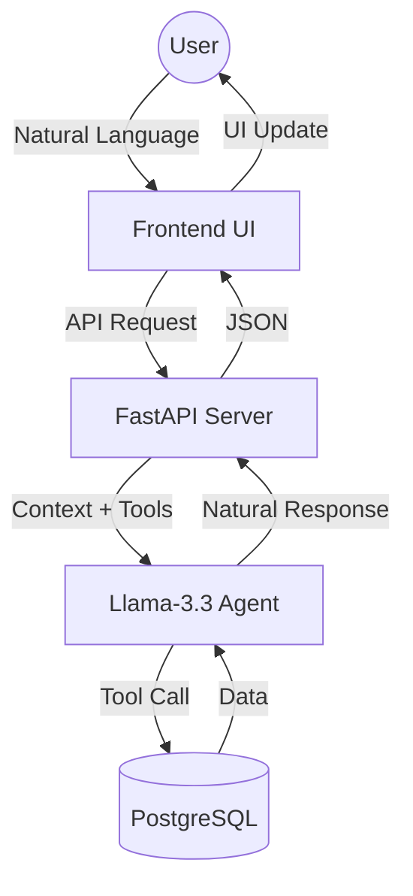

# System Architecture

The Agentic AI Railway Reservation System is built with a modular architecture that separates the reasoning engine from the data layer and the presentation layer.

## Component Overview

- **Frontend (Vanilla JS/CSS/HTML):** Handles user interactions, real-time chat updates, and geodata processing.
- **Backend (FastAPI):** Orchestrates the agentic flow, manages user sessions, and provides RESTful APIs.
- **Agent Reasoning (Llama-3.3):** The core engine that interprets natural language and calls tools for database operations.
- **Database (PostgreSQL):** Persistent storage for trains, users, and bookings.

